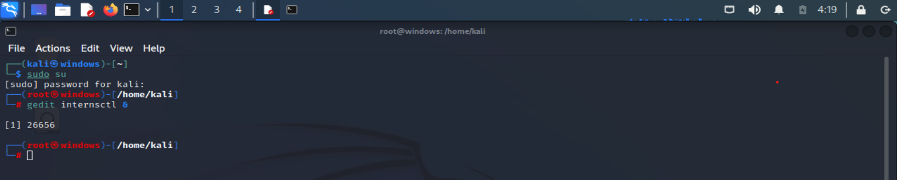
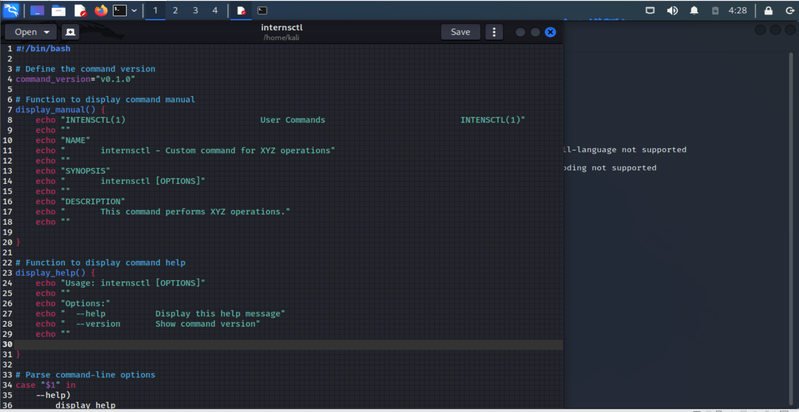
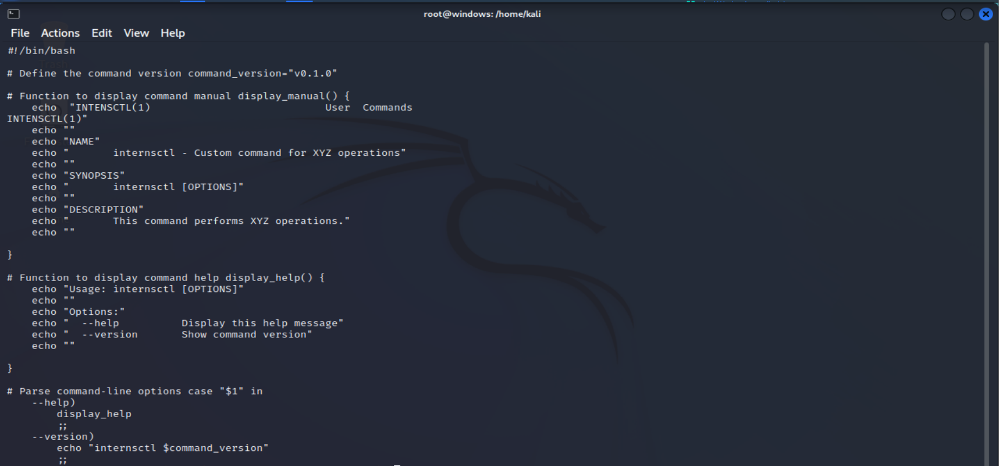
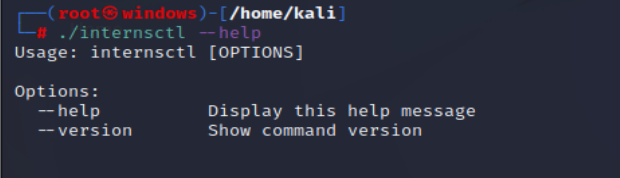
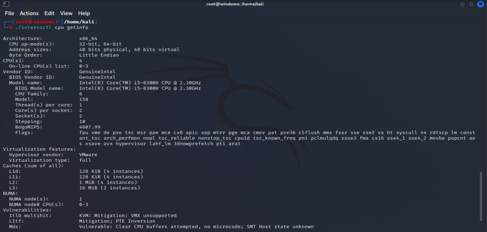
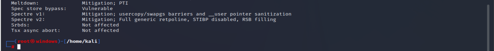

# Linux_bash_scripting
linux task

## Created script named: internsct1

## Write code 

Set execution permissions: Make the script executable using the chmod command:  chmod +x internsctl

Run the script: 
## 1.To view the manual, use man ./internsctl

## 2.To get help, execute ./internsctl --help.

## 3.To check the version, run ./internsctl --version

For NEXT Section after modifying code
## Part A : To get the Cpu information- ./internsctl cpu getinfo

