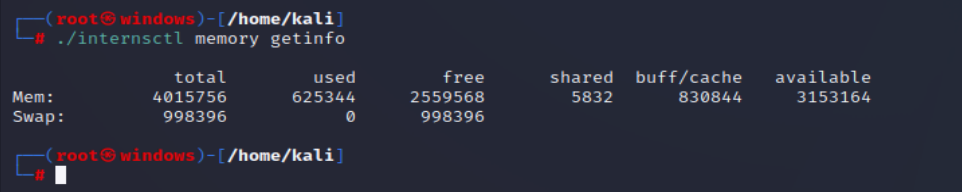
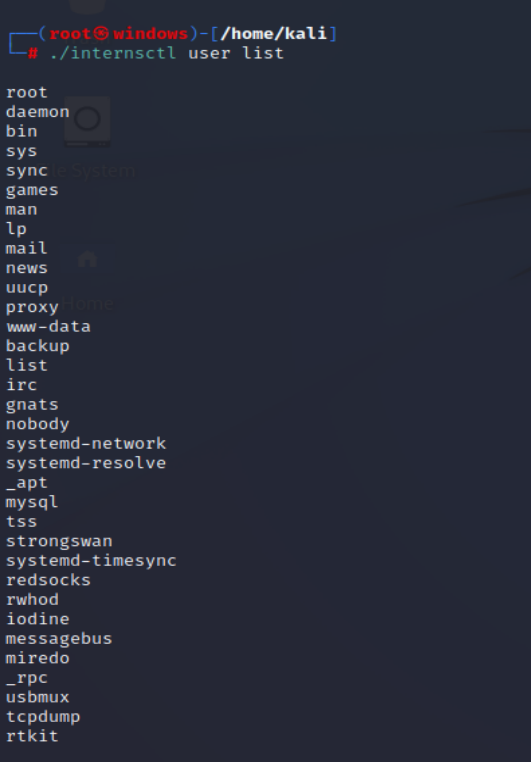
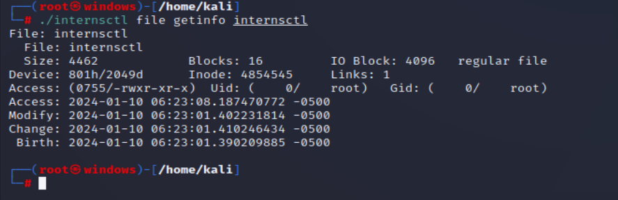
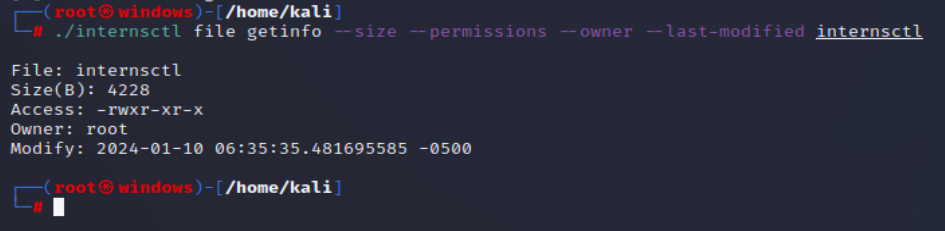

# Linux_bash_scripting
linux task

## Created script named: internsct1

## Write code 

Set execution permissions: Make the script executable using the chmod command:  chmod +x internsctl

Run the script: 
## 1.To view the manual, use man ./internsctl

## 2.To get help, execute ./internsctl --help.

## 3.To check the version, run ./internsctl --version

For NEXT Section after modifying code
## Part A : To get the Cpu information- ./internsctl cpu getinfo

## Get memory information - ./internsctl memory getinfo

## part 2 : Create new user - ./internsctl user create admin

## List all regular users - ./internsctl user list

## To List user with user permission- ./internsctl user list --sudo-only

## Part 3 : Get file information- ./internsctl file getinfo filename

## For specific information- ./internsctl file getinfo --size --permissions --owner --last-modified internsctl

